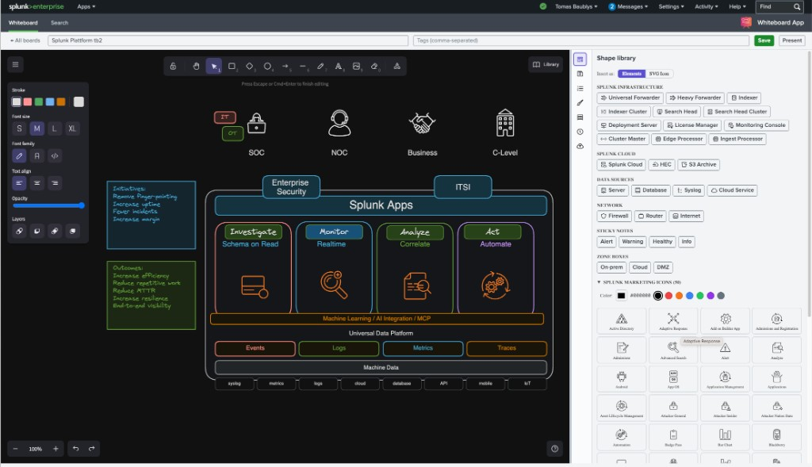

# Splunk Whiteboard App

<p align="center">
  
</p>

Collaborative whiteboard embedded inside Splunk — built with React + [Excalidraw](https://github.com/excalidraw/excalidraw), styled with `@splunk/react-ui`, persisted via Splunk KV Store.

**GitHub:** https://github.com/bautt/splunk-whiteboard-app

<p align="center">
  
</p>

---

## Features

| Area | Details |
|---|---|
| **Drawing** | Free-hand pencil, text, shapes, arrows, sticky notes, eraser |
| **Splunk shapes** | Forwarder (UF/HF), Indexer, Search Head, Deployment Server, Cluster Manager, License Manager, Edge Processor, Ingest Processor, SplunkCloud, and more |
| **SVG icon mode** | All Splunk infrastructure shapes can be inserted as colourable SVG images instead of vector elements |
| **Marketing icons** | 50 Splunk Marketing Icons — searchable, individually colourable, inserted as SVG images onto the canvas |
| **Templates (built-in)** | Splunk Platform (13-step build), Edge Processor, Network Port Diagram, Digital Resilience Platform, SAP E2E Visibility, SIEM, Observability, IT Ops, and more |
| **Templates (user)** | Save any board state as a named template; load or delete from the Templates panel |
| **Excalidraw libraries** | Browse and import from [libraries.excalidraw.com](https://libraries.excalidraw.com/) directly in the sidebar |
| **Persistence** | All boards stored in Splunk KV Store — visible and editable by every Splunk user |
| **Build / reveal-on-click** | PowerPoint-style progressive reveal — tag elements/groups into ordered steps that appear one click at a time in Present mode, with optional fade-in and camera-follow |
| **Version history** | Named snapshots per board with single-click restore |
| **Resizable sidebar** | Drag the left edge of the sidebar to resize; preference saved in `localStorage` |
| **Export** | PNG, SVG, JSON (Excalidraw native), and a shareable board URL |
| **Themes** | Follows Splunk's dark / light colour scheme automatically |

---

## Usage

### Creating and managing boards

1. Open the app at **Apps → Whiteboard App** (or navigate to `/en-US/app/whiteboard_app/whiteboard`).
2. Click **+ New Board** and enter a name. Boards auto-save every few seconds.
3. Rename a board by clicking its title in the board list.
4. Delete a board from the board list (trash icon).

### Drawing

Use the **Excalidraw toolbar** at the top of the canvas:

| Tool | Shortcut |
|---|---|
| Select / Move | `V` or `1` |
| Rectangle | `R` or `3` |
| Diamond | `D` or `4` |
| Ellipse | `O` or `5` |
| Arrow | `A` or `6` |
| Line | `L` or `7` |
| Free-draw | `P` or `8` |
| Text | `T` or `2` |
| Eraser | `E` or `0` |
| Zoom in / out | `Ctrl +` / `Ctrl -` |
| Fit canvas | `Shift 1` |

Double-click any shape to edit its label. Drag elements freely; hold `Shift` to constrain angles.

### Splunk Shape Library

Open the **Shapes** tab in the right sidebar.

- **Insert as elements** mode — adds a grouped Excalidraw element set (editable, scalable).
- **Insert as SVG** mode — adds a colourable SVG image. Use the colour picker or preset swatches to choose the fill colour before inserting.

Categories available:
- **Data Sources** — syslog, database, cloud, API, endpoint
- **Splunk Infrastructure** — Universal Forwarder, Heavy Forwarder, Indexer, Search Head, Cluster Manager, Deployment Server, License Manager, Edge Processor, Ingest Processor, SplunkCloud
- **Network** — firewall, router, switch, load balancer
- **Output / Destinations** — SIEM, ticketing, email, webhook

### Splunk Marketing Icons

At the bottom of the **Shapes** tab, expand **Splunk Marketing Icons**. Pick a colour, then click any icon to insert it onto the canvas as a tinted SVG.

### Templates

Open the **Templates** tab.

**Built-in templates** (read-only):

| Template | Description |
|---|---|
| Splunk Platform (13-step build) | Client → ports → Apps → Investigate/Monitor/Analyze/Act → Machine Data; pre-tagged for PowerPoint-style Present mode |
| Splunk Network Port Diagram | Full port reference: UF/HF → Indexers (9997), HEC (8088), SH (8000/8089), cluster replication |
| Edge Processor Overview | Edge Processor pipeline: sources → EP → Splunk Cloud / on-prem indexers |
| Digital Resilience Platform | SOC/NOC/BOC/OT → Investigate → Monitor → Act, with data-source icons |
| SAP End-to-End Visibility | Business & IT sources → Investigate → Monitor → Analyze → Act |
| SIEM | Log sources → forwarders → indexers → search heads → analyst |
| Observability | Cloud infra → HEC/forwarders → Splunk Cloud → dashboards, alerts, ITSI |
| IT Ops | CMDB, change management, event correlation flow |

**Saving a custom template:**

1. Draw or load any board.
2. In the Templates tab click **💾 Save current board as template**.
3. Enter a name (and optional description) and press **Save template**.

The template appears under **My Templates** and is stored in KV Store (`whiteboard_templates` collection), so all users can see and apply it.

**Deleting a custom template:**

Click the 🗑 icon on a user template card, then confirm with **Delete**.

### Excalidraw Libraries

Open the **Libraries** tab. The panel fetches the live catalog from [libraries.excalidraw.com](https://libraries.excalidraw.com/). Click **Import** on any library to load its shapes into Excalidraw's built-in library panel (bottom-left toolbar icon).

### Build (reveal on click)

Open the **Build** tab to set up a PowerPoint-style progressive reveal.

1. Select elements (or a group) on the canvas and click **Add selection as step N**. Repeat to create an ordered sequence. Whole groups are tagged together.
2. Or click **Auto: by group / left→right / top→bottom / bottom→top** to generate one step per group automatically.
3. Reorder steps with ↑/↓, focus a step on the canvas with ⊙, or remove a step with 🗑.

Then click **Present**. The presenter automatically enters Build mode: each click (or `→` / `Space`) reveals the next step; `←` steps back; `Esc` exits. Toggle **Fade** (smooth fade-in) and **Follow** (camera pans to each new group — off by default) from the presentation bar. The reveal never alters your saved board — the scene is restored on exit.

If a board has no build steps, Present mode falls back to stepping through Excalidraw **frames** as slides.

### Version History

Open the **History** tab. Click **Save snapshot** to capture a named checkpoint. Click **Restore** next to any snapshot to roll the board back to that state.

### Export

Open the **Export** tab for:

- **PNG** — rasterised at 2× resolution
- **SVG** — fully scalable vector export
- **JSON** — Excalidraw-native format (re-import via File → Open)
- **Copy link** — sharable URL that opens this board directly

---

## Build & deploy

```bash
# Install JS dependencies (run once)
make deps

# Start webpack watch (development hot-reload)
make dev

# Full production build → whiteboard_app.tar.gz
make package

# Deploy to your Splunk server and restart Splunkd (required for .conf changes)
make deploy

# Deploy without restarting Splunk (JS, icons, static assets)
make deploy-norestart
```

Set `SPLUNK_HOST` for deploy targets — copy `deploy.local.mk.example` to `deploy.local.mk` (gitignored), or pass on the command line: `make deploy SPLUNK_HOST=user@host`.

> **Note:** `make deploy` restarts Splunkd (required when `collections.conf` or `transforms.conf` changes). For JS/CSS/icon-only changes use `make deploy-norestart` and **hard-refresh** the browser (Cmd+Shift+R) to bust Splunk Web's static-asset cache.

---

## App icon

The app icon is a magenta→orange gradient easel with whiteboard doodles (flowchart, sticky note, checklist). Icons are shipped in **both** `static/` and `appserver/static/` (same files, all sizes) so Splunk picks them up regardless of which path it resolves:

| File | Size | Use |
|---|---|---|
| `appIcon.png` | 36×36 | App listing / launcher (light theme) |
| `appIcon_2x.png` | 72×72 | Retina launcher |
| `appIconAlt.png` | 36×36 | Dark-theme contexts |
| `appIconAlt_2x.png` | 72×72 | Retina dark theme |

Listing / Splunkbase masters live in `assets/listing_icon_200.png` and `assets/listing_icon_400.png`.

Regenerate all sizes from the 400px master:

```bash
python3 assets/generate_alt_icon.py   # requires Pillow + numpy
make package && make deploy-norestart
```

## App structure

```
whiteboard_app/
├── deploy.local.mk.example           # Copy → deploy.local.mk for local deploy host
├── Makefile
├── README.md
├── assets/
│   ├── generate_alt_icon.py            # Regenerate app icons from 400px master
│   ├── listing_icon_200.png            # Splunkbase listing (200×200)
│   ├── listing_icon_400.png            # Splunkbase listing (400×400)
│   └── screenshot.png                  # README product screenshot
└── src/
    ├── package/                        # Splunk app skeleton (copied verbatim to dist/)
    │   ├── default/
    │   │   ├── app.conf                # App identity & version
    │   │   ├── collections.conf        # KV Store collections (whiteboards, versions, templates)
    │   │   ├── transforms.conf         # KV Store lookup definitions
    │   │   └── data/ui/
    │   │       ├── nav/default.xml
    │   │       └── views/whiteboard.xml
    │   ├── static/                     # App icons (mirror — same files as below)
    │   │   ├── appIcon.png             # 36×36 (transparent)
    │   │   ├── appIcon_2x.png          # 72×72
    │   │   ├── appIconAlt.png          # 36×36
    │   │   └── appIconAlt_2x.png       # 72×72
    │   ├── appserver/
    │   │   ├── static/                 # App icons + compiled JS bundle
    │   │   │   ├── appIcon.png         # 36×36 (transparent)
    │   │   │   ├── appIcon_2x.png      # 72×72
    │   │   │   ├── appIconAlt.png      # 36×36
    │   │   │   └── appIconAlt_2x.png   # 72×72
    │   │   └── templates/
    │   │       └── whiteboard.html     # HTML shell loaded by Splunk Web
    │   ├── metadata/default.meta       # ACLs — all collections world-readable/writable
    │   └── app.manifest                # Splunkbase package manifest
    └── web/                            # React frontend (compiled → dist/appserver/static/)
        ├── index.jsx                   # Entry point
        ├── webpack.config.mjs
        ├── package.json
        ├── components/
        │   ├── App.jsx                 # Board list + routing
        │   ├── CanvasPage.jsx          # Main canvas, toolbar, resizable sidebar
        │   ├── ShapesPanel.jsx         # Splunk shape library + Marketing Icons
        │   ├── TemplatePanel.jsx       # Built-in & user templates
        │   ├── LibraryPanel.jsx        # Browse libraries.excalidraw.com
        │   ├── HistoryPanel.jsx        # Version snapshots
        │   └── ExportPanel.jsx         # PNG / SVG / JSON / link export
        ├── hooks/
        │   ├── useKVStore.js           # Board CRUD + auto-save
        │   ├── useVersions.js          # Snapshot CRUD
        │   └── useTemplates.js         # User template CRUD
        ├── lib/
        │   ├── kvstoreClient.js        # Splunk KV Store REST wrapper (CSRF-safe)
        │   ├── shapes.js               # Splunk shape factory functions
        │   ├── marketingIcons.js       # 50 Splunk Marketing Icons (raw SVG strings)
        │   ├── drpIcons.js             # Pre-encoded icons for DRP template
        │   └── nanoid.js               # Lightweight unique-ID generator
        └── templates/
            └── index.js                # All template builder functions + TEMPLATES registry
```

---

## KV Store collections

| Collection | Purpose |
|---|---|
| `whiteboards` | Board metadata + serialised canvas elements |
| `whiteboard_versions` | Timestamped snapshots per board |
| `whiteboard_templates` | User-saved templates (elements + embedded files) |

All three collections grant read/write to all Splunk users (`access = read : [ * ], write : [ * ]` in `metadata/default.meta`).

---

## Adding a new template

1. Open `src/web/templates/index.js`.
2. Write a `buildMyTemplate()` function that returns an array of Excalidraw element objects (or `{ elements, files }` if the template embeds SVG images).
3. Add an entry to the `TEMPLATES` array at the bottom of the file.
4. Run `make package && make deploy-norestart` to deploy.

---

## Adding a new Splunk shape

1. Open `src/web/lib/shapes.js`.
2. Export a new factory function (see `universalForwarder`, `indexer`, etc. as examples).
3. Add it to the `SHAPE_CATEGORIES` export so it appears in the Shapes panel.
4. Optionally map an `@splunk/react-icons` icon in `ShapesPanel.jsx`'s `SHAPE_ICONS` map.

---

## Requirements

| Dependency | Version |
|---|---|
| Splunk Enterprise | 9.x |
| Node.js | 22.x (use `nvm use 22`) |
| Yarn | 1.x |
| Python | 3.x (Splunk app runtime) |
